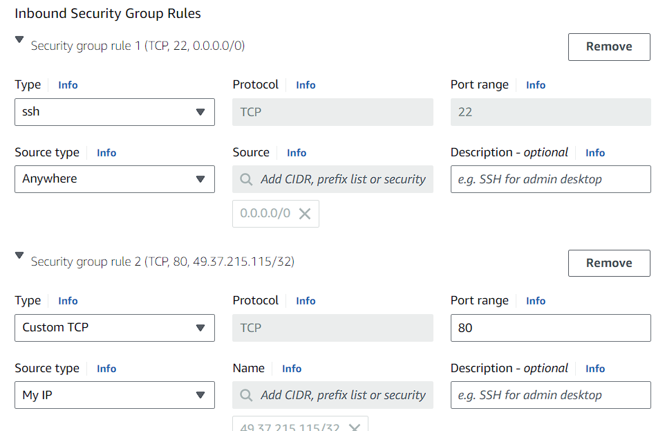

# AWS-Load-Balancer-Setup-Guide
AWS Load Balancer Setup Guide
# AWS Load Balancer Setup Guide

This guide provides step-by-step instructions for setting up an AWS load balancer with an EC2 instance running a web server.

## Prerequisites

- AWS account
- Basic knowledge of AWS EC2, AMI, and Load Balancers

## Step 1: Create an EC2 Instance

1. **Launch Instance**
   - Name the instance: `web01_load_balancer` (or any name you prefer)
   - Select the AMI: `Amazon Linux (free tier)`
   - Instance type: `t2.micro (free tier)`
   - Create a new key pair
     


2. **Configure Security Group**
   - Security group name: `wavecafe-web`
   - Edit Inbound traffic rules as needed
   

3. **Advanced Details**
   - Paste the following script in the User Data section:

     ```bash
     #!/bin/bash
     # Variable Declaration
     PACKAGE="httpd wget unzip"
     SVC="httpd"
     URL='https://www.tooplate.com/zip-templates/2098_health.zip'
     ART_NAME='2098_health'
     TEMPDIR="/tmp/webfiles"

     yum --help &> /dev/null
     if [ $? -eq 0 ]; then
         # CentOS Setup
         PACKAGE="httpd wget unzip"
         SVC="httpd"
         sudo yum install $PACKAGE -y > /dev/null
         sudo systemctl start $SVC
         sudo systemctl enable $SVC
         mkdir -p $TEMPDIR
         cd $TEMPDIR
         wget $URL > /dev/null
         unzip $ART_NAME.zip > /dev/null
         sudo cp -r $ART_NAME/* /var/www/html/
         systemctl restart $SVC
         rm -rf $TEMPDIR
         sudo systemctl status $SVC
     else
         # Ubuntu Setup
         PACKAGE="apache2 wget unzip"
         SVC="apache2"
         sudo apt update
         sudo apt install $PACKAGE -y > /dev/null
         sudo systemctl start $SVC
         sudo systemctl enable $SVC
         mkdir -p $TEMPDIR
         cd $TEMPDIR
         wget $URL > /dev/null
         unzip $ART_NAME.zip > /dev/null
         sudo cp -r $ART_NAME/* /var/www/html/
         systemctl restart $SVC
         rm -rf $TEMPDIR
         sudo systemctl status $SVC
     fi
     ```

4. **Launch the Instance**
   - After launching, wait for the instance to initialize.
   - Access the website using the instance's Public IPv4 address.
   

## Step 2: Create an AMI from the Instance

1. **Create AMI**
   - Select the instance
   - Go to Actions > Image and templates > Create image
   - Provide an Image name and modify instance volume if needed
   - Click on `Create image`
   - Check the created AMI in the AMI section
   

2. **Launch an Instance from the AMI**
   - Click on `Launch instance from AMI`
   - Follow the steps to launch a new instance
   

## Step 3: Create a Launch Template

1. **Launch Template**
   - Select the AMI
   - Choose the instance type and key pair
   - Create the template
   

## Step 4: Create a Load Balancer

1. **Create Target Group**
   - Create a target group and select the instances
   

2. **Create Load Balancer**
   - Select `Application Load Balancer` and create
   - Configure a new security group
   - Add the instances to the target group
   

3. **Configure Security Group**
   - Edit the inbound rules of the security group
   

## Step 5: Test the Load Balancer

1. **Check Targets**
   - Go to the target group section and ensure the targets are healthy
   

2. **Access the Load Balancer**
   - Copy the DNS name of the load balancer and paste it into a browser
   - Verify that the website is working
   

## Conclusion

By following these steps, you have successfully set up an EC2 instance, created an AMI, configured a launch template, and set up an application load balancer in AWS.

## Author

- [Your Name]

